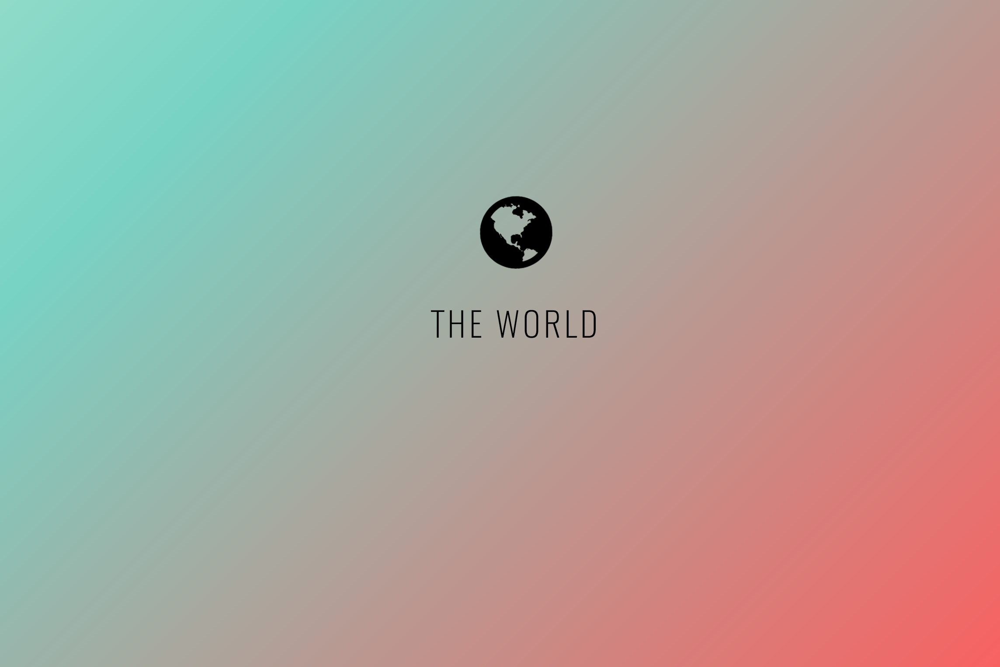

# The World

Small project made for school using the <a href="https://restcountries.eu/">Rest Countries-API</a>.
Built with React. Environment set up with the help of <a href="https://reacttraining.com">React Fundamentals</a>


### Prerequisites

To run the World locally:

```
$ npm install
$ npm run start
```

### Build and deploy

```
# To set up firebase
$ npm run firebase-init

# To build and deploy to firebase
$ npm run deploy
```
### Find project online
Project can be found at <a href="https://the-world-bd60b.firebaseapp.com/">https://the-world-bd60b.firebaseapp.com/</a>
